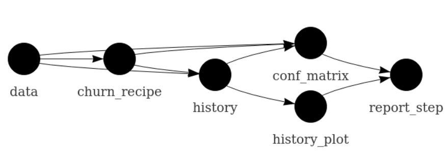
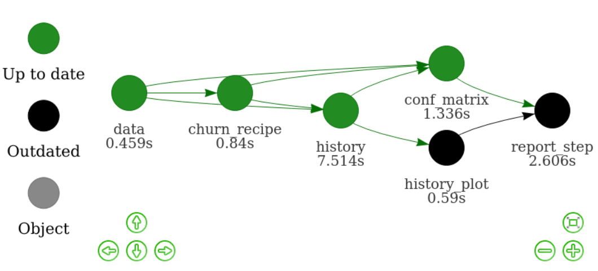

```{r c1, include = FALSE}
options(
  warnPartialMatchArgs = FALSE,
  drake_clean_menu = FALSE,
  drake_make_menu = FALSE
)
packages <- c(
  "drake",
  "keras",
  "recipes",
  "rsample",
  "tidyverse",
  "yardstick"
)
unlink(".RData")
purrr::walk(
  packages,
  function(pkg) {
    suppressMessages(suppressWarnings(library(pkg, character.only = TRUE)))
  }
)
clean(destroy = TRUE, verbose = FALSE)
knitr::opts_chunk$set(
  collapse = TRUE,
  warning = TRUE,
  error = TRUE
)
```

## Purpose: manage long runtimes


## Data analysis workflows can be complicated.


## When you go back and change something...


## ...everything downstream is **no longer valid**.


## Do you rerun **everything** from scratch?

- Takes too long.
- Too frustrating.


<div style="font-size: 0.5em;"><a href="https://openclipart.org/detail/275842/sisyphus-overcoming-silhouette">https://openclipart.org/detail/275842/sisyphus-overcoming-silhouette</a></div>

## Do you manually hunt for pieces to update?

- Messy and prone to human error.
- Not reproducible.


<div style="font-size: 0.5em;"><a href="https://openclipart.org/detail/216179/messy-desk">https://openclipart.org/detail/216179/messy-desk</a></div>

## Pipeline toolkits solve this problem.

- Sophisticated, vibrant, active space of tools: [github.com/pditommaso/awesome-pipeline](https://github.com/pditommaso/awesome-pipeline).
- Most are language-agnostic or designed for other languages.
- [**`drake`**](https://github.com/ropensci/drake) is uniquely devoted to R.
    - A focus on ordinary R functions and variables rather than cumbersome files.
    - Heavy use of the data frame, even as a substitute for the  traditional [Makefile](https://www.gnu.org/software/make).
    - Native [tidy evaluation](https://tidyeval.tidyverse.org) support.
    - A [domain-specific language (DSL)](http://adv-r.had.co.nz/dsl.html) for [creating large workflows](https://ropenscilabs.github.io/drake-manual/plans.html#large-plans).

## Example uses in the pharmaceutical industry

<br>

- Clinical trial modeling and simulation
- Subgroup identification
- Bayesian network meta analysis
- Graph-based multiple comparison procedures
- Bayesian networks in genomics
- PK/PD modeling (e.g. [`mrgsolve`](https://github.com/metrumresearchgroup/mrgsolve))
- **Deep learning**

## Example deep learning workflow

- Goal: predict customers who cancel their subscriptions with a telecom company.
- Data: [IBM Watson Telco Customer Churn dataset](https://www.ibm.com/communities/analytics/watson-analytics-blog/predictive-insights-in-the-telco-customer-churn-data-set/).
- Workflow principles generalize to pharma, e.g. business analytics and genomics problems.


<div style="font-size: 0.5em;"><a href="https://openclipart.org/detail/90739/newplus">https://openclipart.org/detail/90739/newplus</a>, <a href="https://github.com/rstudio/keras">https://github.com/rstudio/keras</a></div>

## File structure

<br>
<br>

```
make.R
R/
├── packages.R
├── functions.R
└── plan.R
data/
└── customer_churn.csv
```

## `packages.R`

```{r c2, eval = FALSE}
# packages.R
library(drake)
library(keras)
library(recipes)
library(rsample)
library(tidyverse)
library(yardstick)
```

## `functions.R`

```{r c3, eval = FALSE}
# functions.R
prepare_recipe <- function(data) {
  # ... 
}

define_model <- function(churn_recipe) {
  # ...
}

fit_model <- function(data, churn_recipe, model_file) {
  # ...
}

get_conf_matrix <- function(data, churn_recipe, model_file) {
  # ...
}
```

## `plan.R`

```{r c4}
# plan.R
plan <- drake_plan(
  data = read_csv(file_in("data/customer_churn.csv"), col_types = cols()) %>%
    initial_split(prop = 0.3),
  churn_recipe = prepare_recipe(data),
  history = fit_model(data, churn_recipe, file_out("model.h5")),
  history_plot = plot(history),
  conf_matrix = get_conf_matrix(data, churn_recipe, file_in("model.h5")),
  report_step = rmarkdown::render(
    knitr_in("results.Rmd"),
    output_file = file_out("results.html"),
    quiet = TRUE
  )
)
```

## The plan is a data frame.

```{r c5}
plan
```

## The workflow



## Run the project in `make.R`

```{r c6}
# make.R
source("R/packages.R")
source("R/functions.R")
source("R/plan.R")

make(plan)
```

## Inspect the results.

```{r c7, out.width = "50%", out.height = "50%", fig.width = 5, fig.height = 4}
readd(history_plot) # See also loadd()
```

## Update the plan.

```{r c8}
# plan.R
plan <- drake_plan(
  data = read_csv(file_in("data/customer_churn.csv"), col_types = cols()) %>%
    initial_split(prop = 0.3),
  churn_recipe = prepare_recipe(data),
  history = fit_model(data, churn_recipe, file_out("model.h5")),
  history_plot = plot(history) +
    theme_bw(), # modification
  conf_matrix = get_conf_matrix(data, churn_recipe, file_in("model.h5")),
  report_step = rmarkdown::render(
    knitr_in("results.Rmd"),
    output_file = file_out("results.html"),
    quiet = TRUE
  )
)
```

```{r c8write, echo = FALSE}
tmp <- file.copy("R/plan.R", "R/tmp.R", overwrite = TRUE)
tmp <- file.copy("R/plan2.R", "R/plan.R", overwrite = TRUE)
```

## `vis_drake_graph()`



## Refresh the results.

```{r c9}
# make.R
source("R/packages.R")
source("R/functions.R")
source("R/plan.R") # modified

make(plan)
```

## See updated results.

```{r c7updated, out.width = "50%", out.height = "50%", fig.width = 5, fig.height = 4}
readd(history_plot)
```

## Continue iterating to improve the model...

```{r c7updated2}
readd(conf_matrix)
```

## Evidence of reproducibility.

```{r c10}
# make.R
source("R/packages.R")
source("R/functions.R")
source("R/plan.R")

make(plan)
```

<ul style="text-align: left">
<li>See also `outdated()`.</li>
</ul>


## Scale up the number of models.

```{r, plan2}
dataset_index <- seq_len(50)
plan <- drake_plan(
  data = target(
    download_dataset(source),
    transform = map(source = !!dataset_index)
  ),
  history = target(
    fit_my_model(data, learning_rate = lr),
    transform = cross(data, lr = c(1e-5, 1e-4, 1e-3))
  ),
  best = target(
    get_best_model(history),
    transform = combine(history)
  )
)
```

## Scale up the number of models.

```{r, plan3}
plan
```

## `drake_ggraph()` for large graphs

```{r, plan3graph, echo = FALSE, out.width = "70%", out.height = "70%", fig.width = 6, fig.height = 4}
config <- drake_config(plan)
drake_ggraph(config, targets_only = TRUE)
```

## High-performance computing.

```{r c11, eval = FALSE}
# make.R

# template file with configuration
drake_hpc_template_file("slurm_clustermq.tmpl")

# Use SLURM resource manager with the template.
options(
  clustermq.scheduler = "slurm",
  clustermq.template = "slurm_clustermq.tmpl"
)

# make() is the basically the same.
make(plan, jobs = 2, parallelism = "clustermq")
```

## High-performance computing.

<script src="https://fast.wistia.com/embed/medias/ycczhxwkjw.jsonp" async></script><script src="https://fast.wistia.com/assets/external/E-v1.js" async></script><div class="wistia_responsive_padding" style="padding:56.21% 0 0 0;position:relative;"><div class="wistia_responsive_wrapper" style="height:100%;left:0;position:absolute;top:0;width:100%;"><div class="wistia_embed wistia_async_ycczhxwkjw videoFoam=true" style="height:100%;position:relative;width:100%"><div class="wistia_swatch" style="height:100%;left:0;opacity:0;overflow:hidden;position:absolute;top:0;transition:opacity 200ms;width:100%;"></div></div></div></div>

## Resources

```{r c12, eval = FALSE}
install.packages("drake")                  # release
devtools::install_github("ropensci/drake") # development
```

- [Today's code](https://github.com/wlandau/drake-examples/tree/master/deep-learning): `drake_example("deep-learning")`
- [Reference website](https://ropensci.github.io/drake/)
- [Full user manual](https://ropenscilabs.github.io/drake-manual/)
- [Example workflows](https://github.com/wlandau/drake-examples)
- [File an issue](https://github.com/ropensci/drake/issues).
- [Contribute code](https://github.com/ropensci/drake/pulls).
- [Discuss at rOpenSci.org](https://discuss.ropensci.org).

## Today's example

<br>
<br>
<ul style = "float: left: width: 49%">

<li><a href = "https://github.com/edgararuiz">Edgar Ruiz</a></li>
<li><a href = "https://github.com/sol-eng/tensorflow-w-r/blob/master/workflow/tensorflow-drake.Rmd">example code</a></li>
</ul>
<ul style = "float: right; width: 49%">

<li><a href = "https://github.com/mdancho84">Matt Dancho</a></li>
<li><a href = "https://blogs.rstudio.com/tensorflow/posts/2018-01-11-keras-customer-churn/">blog post</a></li>
</ul>

## Development

<br>
<ul style = "float: left: width: 49%">

<li><a href = "https://github.com/maelle">Maëlle Salmon</a></li>
<li><a href = "https://github.com/benmarwick">Ben Marwick</a></li>
<li><a href = "https://github.com/jules32">Julia Lowndes</a></li>
<li><a href = "https://github.com/gothub">Peter Slaughter</a></li>
<li><a href = "https://github.com/jennybc">Jenny Bryan</a></li>
<li><a href = "https://github.com/richfitz">Rich FitzJohn</a></li>
<li><a href = "https://github.com/stefaniebutland">Stefanie Butland</a></li>
</ul>
<ul style = "float: right; width: 49%">
<li><a href = "https://github.com/jarad">Jarad Niemi</a></li>
<li><a href = "https://github.com/krlmlr">Kirill Müller</a></li>
<li><a href = "https://github.com/HenrikBengtsson">Henrik Bengtsson</a></li>
<li><a href = "https://github.com/milesmcbain">Miles McBain</a></li>
<li><a href = "https://github.com/pat-s">Patrick Schratz</a></li>
<li><a href = "https://github.com/kendonB">Kendon Bell</a></li>
<li><a href = "https://github.com/AlexAxthelm">Alex Axthelm</a></li>
<li><a href = "https://github.com/dapperjapper">Jasper Clarkberg</a></li>
<li><a href = "https://github.com/dfalster">Daniel Falster</a></li>
<li><a href = "https://github.com/mrchypark">Chan-Yub Park</a></li>
<li><a href = "https://github.com/tiernanmartin">Tiernan Martin</a></li>

</ul>

```{r c13, include = FALSE}
tmp <- file.copy("R/plan.R", "R/plan2.R", overwrite = TRUE)
tmp <- file.copy("R/tmp.R", "R/plan.R", overwrite = TRUE)
unlink("R/tmp.R")
clean(destroy = TRUE)
```
