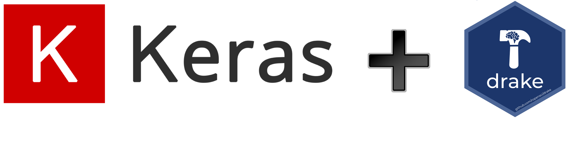
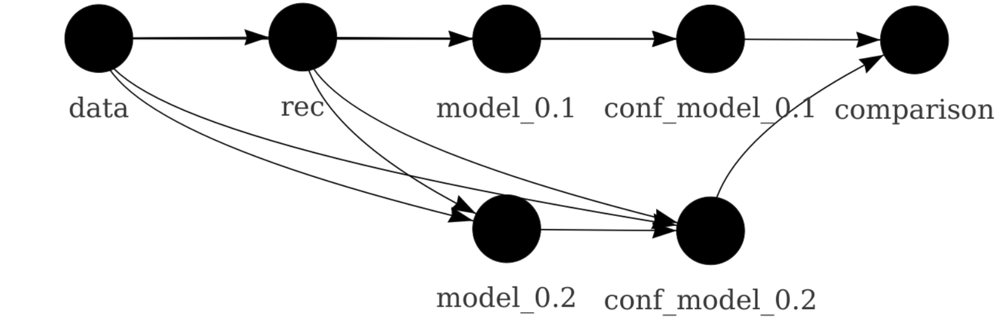
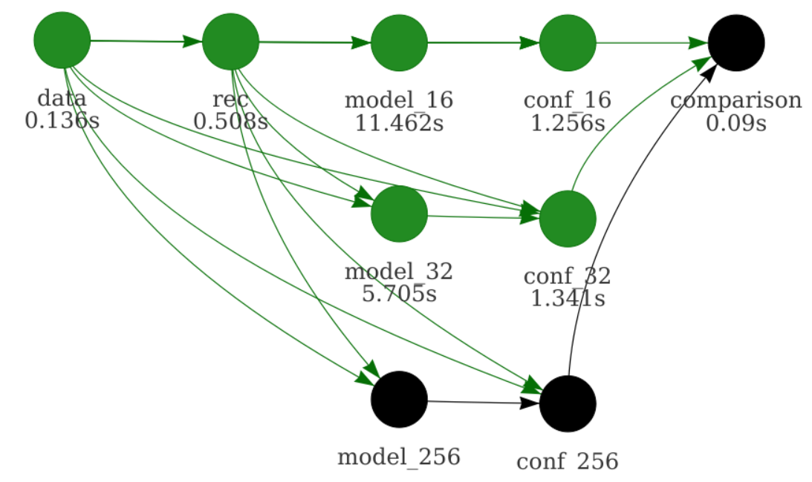

<style>
.inverse {
  background-color: transparent;
  text-shadow: 0 0 0px transparent;
}
.title-slide {
  vertical-align: bottom !important; 
  text-align: center !important;
}
.title-slide h1 {
  position: absolute;
  top: 0;
  left: 0;
  right: 0;
  width: 100%;
  line-height: 4em;
  color: #666666;
}
.title-slide h3 {
  line-height: 6em;
  color: #666666;
}
.title-slide {
  background-color: white;
  background-image: url('images/logo.png');
  background-repeat: no-repeat;
  background-size: 25%;
}
.remark-slide-content:after {
  content: "Copyright Eli Lilly and Company";
  position: absolute;
  bottom: -5px;
  left: 20px;
  height: 40px;
  width: 100%;
  font-family: Helvetica, Arial, sans-serif;
  color: gray;
  background-repeat: no-repeat;
  background-size: contain;
}
</style>

```{r c1, include = FALSE}
options(
  warnPartialMatchArgs = FALSE,
  drake_clean_menu = FALSE,
  drake_make_menu = FALSE,
  htmltools.dir.version = FALSE
)
packages <- c(
  "drake",
  "keras",
  "recipes",
  "rsample",
  "tidyverse",
  "yardstick"
)
unlink(".RData")
purrr::walk(
  packages,
  function(pkg) {
    suppressMessages(suppressWarnings(library(pkg, character.only = TRUE)))
  }
)
clean(destroy = TRUE, verbose = FALSE)
knitr::opts_chunk$set(
  collapse = TRUE,
  fig.align = "center",
  fig.width = 10,
  fig.height = 7,
  out.width = "80%",
  out.height = "80%"
)
```

## Purpose: manage data analyses with long runtimes

<center>

</center>

---

## Workflows have interconnected steps.
<center>

</center>

---

## When change something...
<center>

</center>

---

## ...downstream steps are **no longer valid**.

<center>

</center>

---

## Do you rerun **everything** from scratch?

- Takes too long.
- Too frustrating.

<center>

<div style="font-size: 0.5em; text-align: center"><a href="https://openclipart.org/detail/275842/sisyphus-overcoming-silhouette">https://openclipart.org/detail/275842/sisyphus-overcoming-silhouette</a></div>
</center>

---

## Do you pick and choose pieces to update?

- Messy and prone to human error.
- Not reproducible.

<center>

<div style="font-size: 0.5em; text-align: center;"><a href="https://openclipart.org/detail/216179/messy-desk">https://openclipart.org/detail/216179/messy-desk</a></div>
</center>

---

## Pipeline toolkits solve this problem.

- Sophisticated, vibrant, active space of tools: [github.com/pditommaso/awesome-pipeline](https://github.com/pditommaso/awesome-pipeline).
- Most are language-agnostic or designed for other languages.
- [**`drake`**](https://github.com/ropensci/drake) is uniquely devoted to R.
    - A focus on ordinary R functions and variables rather than cumbersome files.
    - Heavy use of the data frame, even as a substitute for the  traditional [Makefile](https://www.gnu.org/software/make).
    - Native [tidy evaluation](https://tidyeval.tidyverse.org) support.
    - A [domain-specific language (DSL)](http://adv-r.had.co.nz/dsl.html) for [creating large workflows](https://ropenscilabs.github.io/drake-manual/plans.html#large-plans).

---

## Example uses in the pharmaceutical industry

<br>

- Clinical trial modeling and simulation
- Subgroup identification
- Bayesian network meta analysis
- Graph-based multiple comparison procedures
- Bayesian networks in genomics
- PK/PD modeling (e.g. [`mrgsolve`](https://github.com/metrumresearchgroup/mrgsolve))
- **Deep learning**

---

## Example deep learning workflow

- Goal: predict customers who cancel their subscriptions with a telecom company.
- Data: [IBM Watson Telco Customer Churn dataset](https://www.ibm.com/communities/analytics/watson-analytics-blog/predictive-insights-in-the-telco-customer-churn-data-set/).
- Workflow principles generalize to pharma, e.g. business analytics and genomics problems.



<div style="font-size: 0.5em;"><a href="https://openclipart.org/detail/90739/newplus">https://openclipart.org/detail/90739/newplus</a>, <a href="https://github.com/rstudio/keras">https://github.com/rstudio/keras</a></div>

---

## File structure

<br>
<br>

```{r files, eval = FALSE}
make.R
R/
├── packages.R
├── functions.R
└── plan.R
data/
└── customer_churn.csv
```

---

## packages.R

```{r c2, eval = FALSE}
library(drake)
library(keras)
library(recipes)
library(rsample)
library(tidyverse)
library(yardstick)
```

---

## functions.R

```{r c3, eval = FALSE}
prepare_recipe <- function(data) {
  # ... 
}

define_model <- function(rec) {
  # ...
}

train_model <- function(data, batch_size) {
  # ...
}

confusion_matrix <- function(data, rec, serialized_model) {
  # ...
}

compare_models <- function(...) {
  # ...
}
```

---

## plan.R

```{r c4}
batch_sizes <- c(16, 32)

plan <- drake_plan(
  data = read_csv(file_in("data/customer_churn.csv")) %>%
    initial_split(prop = 0.3),
  rec = prepare_recipe(data),
  model = target(
    train_model(data, rec, batch_size),
    transform = map(batch_size = !!batch_sizes)
  ),
  conf = target(
    confusion_matrix(data, rec, model),
    transform = map(model, .id = batch_size)
  ),
  comparison = target(
    compare_models(conf),
    transform = combine(conf)
  )
)
```

---

## Data frame of workflow steps

```{r c5}
plan
```

---

## The workflow

<br>
<center>

</center>

---

## Run the project in make.R.

```{r c6}
source("R/packages.R")
source("R/functions.R")
source("R/plan.R")

make(plan)
```

---

## Compare models.

```{r c7}
readd(comparison) # See also loadd()
```

---

## Try another batch size.

```{r c8}
batch_sizes <- c(16, 32, 64) #<<

plan <- drake_plan(
  data = read_csv(file_in("data/customer_churn.csv")) %>%
    initial_split(prop = 0.3),
  rec = prepare_recipe(data),
  model = target(
    train_model(data, rec, batch_size),
    transform = map(batch_size = !!batch_sizes) #<<
  ),
  conf = target(
    confusion_matrix(data, rec, model),
    transform = map(model, .id = batch_size)
  ),
  comparison = target(
    compare_models(conf),
    transform = combine(conf)
  )
)
```

```{r c8write, echo = FALSE}
tmp <- file.copy("R/plan.R", "R/tmp.R", overwrite = TRUE)
tmp <- file.copy("R/plan2.R", "R/plan.R", overwrite = TRUE)
```

---

## vis_drake_graph()

<center>

</center>

---

## Refresh the results in make.R.

```{r c9}
source("R/packages.R")
source("R/functions.R")
source("R/plan.R") # modified #<<

make(plan)
```

---

## Compare models.

```{r c7updated}
readd(comparison)
```

---

## Evidence of reproducibility.

```{r c10}
source("R/packages.R")
source("R/functions.R")
source("R/plan.R")

make(plan)
```

- See also `outdated()`.

---

## High-performance computing.

```{r c11, eval = FALSE}
# template file with configuration
drake_hpc_template_file("slurm_clustermq.tmpl")

# Use SLURM resource manager with the template.
options(
  clustermq.scheduler = "slurm",
  clustermq.template = "slurm_clustermq.tmpl"
)

# make() is the basically the same.
make(plan, jobs = 2, parallelism = "clustermq")
```

---

## High-performance computing.

<iframe width="800" height="450" src="https://www.powtoon.com/embed/bUfSIaXjrw5/" frameborder="0"></iframe>

---

## Resources

```{r c12, eval = FALSE}
install.packages("drake")                  # release
devtools::install_github("ropensci/drake") # development
```

- [Today's code](https://github.com/wlandau/drake-examples/tree/master/deep-learning): `drake_example("deep-learning")`
- [Reference website](https://ropensci.github.io/drake/)
- [Full user manual](https://ropenscilabs.github.io/drake-manual/)
- [Example workflows](https://github.com/wlandau/drake-examples)
- [File an issue](https://github.com/ropensci/drake/issues).
- [Contribute code](https://github.com/ropensci/drake/pulls).
- [Discuss at rOpenSci.org](https://discuss.ropensci.org).

---

## Thanks

<br>
<br>
<table style = "border: none">
<tr>
<td style = "padding-right: 125px">
<ul style>

<li><a href = "https://github.com/edgararuiz">Edgar Ruiz</a></li>
<li><a href = "https://github.com/sol-eng/tensorflow-w-r/blob/master/workflow/tensorflow-drake.Rmd">example code</a></li>
</ul>
</td>
<td>
<ul>

<li><a href = "https://github.com/mdancho84">Matt Dancho</a></li>
<li><a href = "https://blogs.rstudio.com/tensorflow/posts/2018-01-11-keras-customer-churn/">blog post</a></li>
</ul>
</td>
</tr>
</table>

---

## Thanks

<table style = "border: none">
<tr>
<td>
<br>
<ul>

<li><a href = "https://github.com/maelle">Maëlle Salmon</a></li>
<li><a href = "https://github.com/benmarwick">Ben Marwick</a></li>
<li><a href = "https://github.com/jules32">Julia Lowndes</a></li>
<li><a href = "https://github.com/gothub">Peter Slaughter</a></li>
<li><a href = "https://github.com/jennybc">Jenny Bryan</a></li>
<li><a href = "https://github.com/richfitz">Rich FitzJohn</a></li>
<li><a href = "https://github.com/stefaniebutland">Stefanie Butland</a></li>
</ul>
</td>
<td>
<ul>
<li><a href = "https://github.com/jarad">Jarad Niemi</a></li>
<li><a href = "https://github.com/krlmlr">Kirill Müller</a></li>
<li><a href = "https://github.com/HenrikBengtsson">Henrik Bengtsson</a></li>
<li><a href = "https://github.com/mschubert">Michael Schubert</a></li>
<li><a href = "https://github.com/kendonB">Kendon Bell</a></li>
<li><a href = "https://github.com/milesmcbain">Miles McBain</a></li>
<li><a href = "https://github.com/pat-s">Patrick Schratz</a></li>
<li><a href = "https://github.com/AlexAxthelm">Alex Axthelm</a></li>
<li><a href = "https://github.com/dapperjapper">Jasper Clarkberg</a></li>
<li><a href = "https://github.com/tiernanmartin">Tiernan Martin</a></li>
<li><a href = "https://github.com/BListyg">Ben Listyg</a></li>
<li><a href = "https://github.com/tjmahr">TJ Mahr</a></li>
<li><a href = "https://github.com/bpbond">Ben Bond-Lamberty</a></li>
<li><a href = "https://github.com/tmastny">Tim Mastny</a></li>
<li><a href = "https://github.com/billdenney">Bill Denney</a></li>
<li><a href = "https://github.com/aedobbyn">Amanda Dobbyn</a></li>
<li><a href = "https://github.com/dfalster">Daniel Falster</a></li>
<li><a href = "https://github.com/rkrug">Rainer Krug</a></li>
<li><a href = "https://github.com/bmchorse">Brianna McHorse</a></li>
<li><a href = "https://github.com/mrchypark">Chan-Yub Park</a></li>
</ul>
</td>
</tr>
</table>

```{r c13, include = FALSE}
tmp <- file.copy("R/plan.R", "R/plan2.R", overwrite = TRUE)
tmp <- file.copy("R/tmp.R", "R/plan.R", overwrite = TRUE)
unlink("R/tmp.R")
clean(destroy = TRUE)
```
